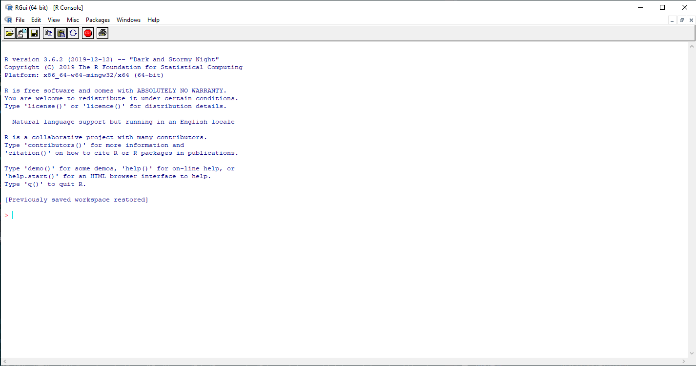
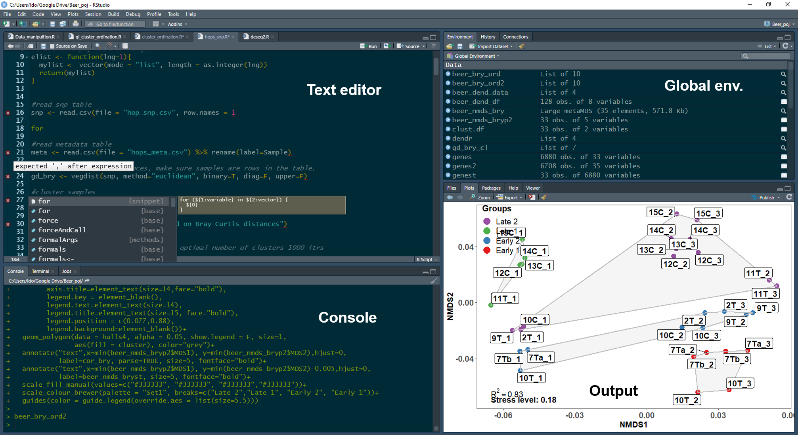
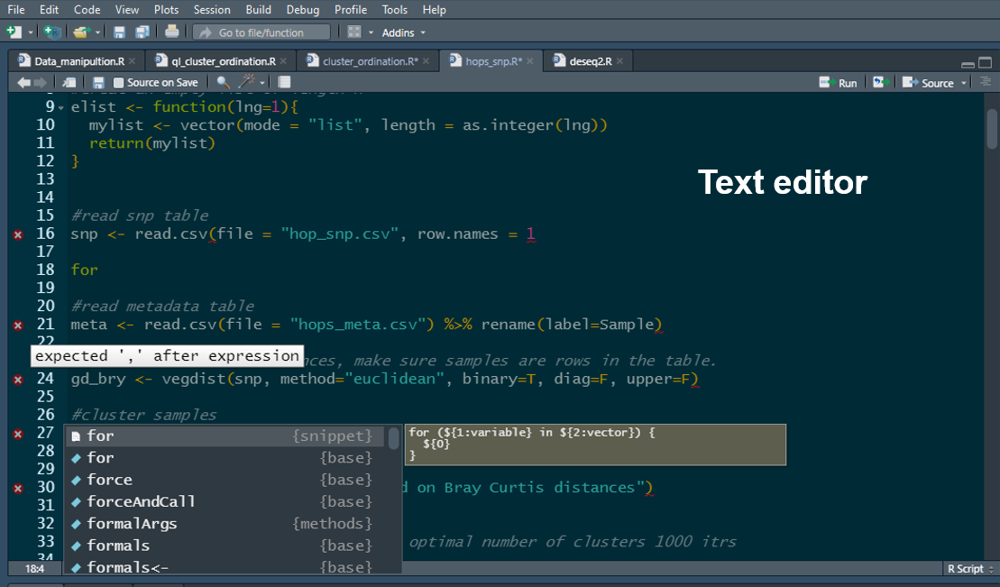
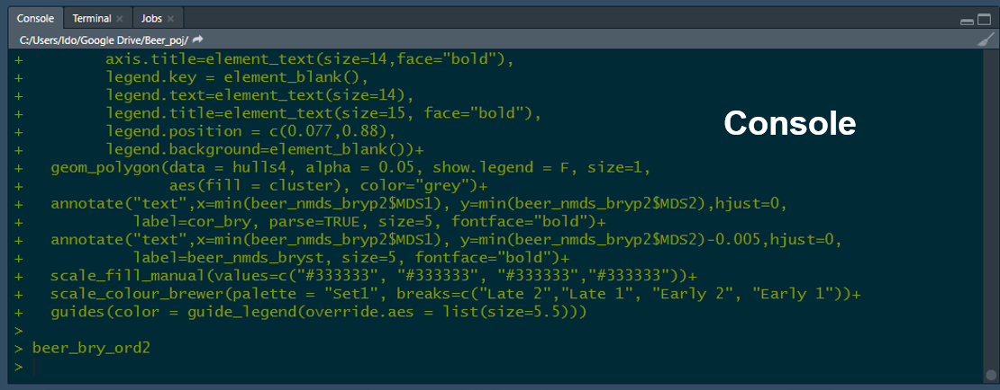
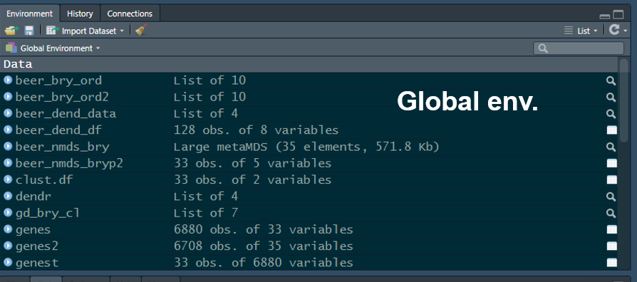
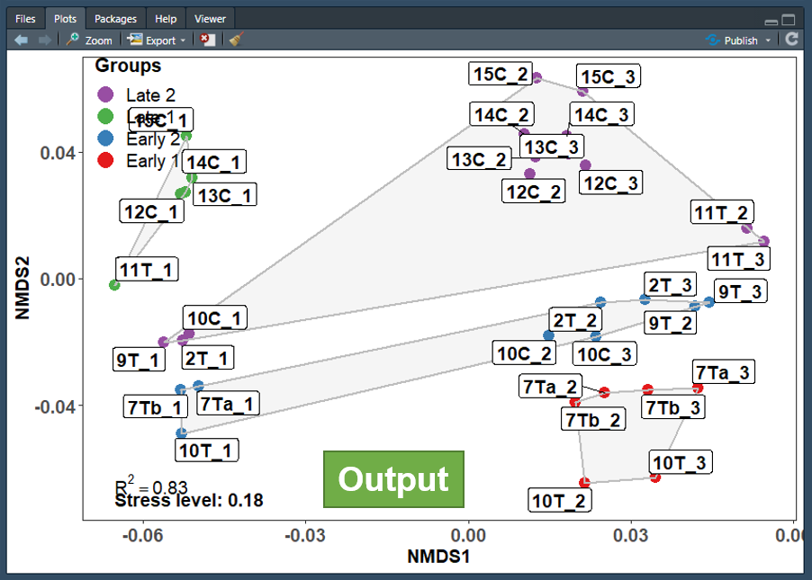
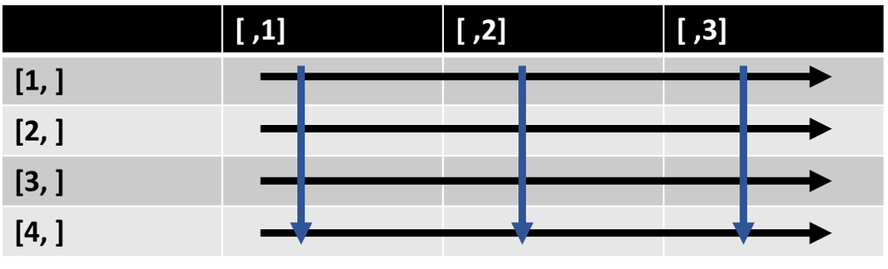

```{r setup, include=FALSE}
knitr::opts_chunk$set(echo = TRUE, comment = "", prompt = TRUE ,class.source = "fold-show")
options(knitr.duplicate.label = "allow")

```

# **Lab 1 introduction to the R programming language and the R studio IDE** {-}

## **Learning objectives** {-}
<details>
  <summary>Click to expand</summary>
__By the end of this lab you will be able to:__

* Install the R interpreter and the Rstudio integrated development environment

*	Demonstrate the ability to install and load packages from a variety of repositories including development versions from github

* Understand the different components of the Rstudio environment

*	Demonstrate mastery of R object and data types including indexing, subseting and manipulating objects

*	Demonstrate the ability to call and chain functions

</details>

<br>

## **Getting started**{-}

### **What is R?**{-}

R is a free and open source programming language, operating as a [GUN project](http://www.gnu.org/). The R language is maintained and supported by the [R Foundation for Statistical Computing](https://www.r-project.org/foundation/).

>"R is a functional programming language and environment for statistical computing and graphics"
>
>  --- The R dev team

R is best known as a programming language with strong capabilities of 
manipulation, exploration and statistical analysis of data from diverse
types and sources. However, it also provides an environment for data
handling, graphical representation of data as well as data reporting.
R is a great platform for documentation and in fact this entire lab
manual was written in R using the rmarkdown package.

### **Why use R?**{-}

* Open source and free 
  * Available on all major platform 
* Large community of users and developers (over 2M users in academia, government, and industry)
* Thousands of open source packages aimed at the analysis of biological data in general and genomic and evolutionary data in particular
* Customizable and allows for the construction of pipelines
* Reproducible analysis


### **Downloading and installing R and RStudio desktop**{-}

To download R, go to the [R download page](https://cran.r-project.org/mirrors.html) select the SFU mirror then select your operating system and download and install both 32 and 64 bit versions.

To download RStudio desktop, go to the [RStudio download page](https://posit.co/download/rstudio-desktop/) and download the free RStudio desktop version.
 
*** 

>Note that you must download and install both R and RStudio in order to be able to work with R in the RStudio IDE.
Note that it is important that you have the most uptodate verssion of R, even if R is already installed on your computer 
make sure to update it. If using Windows you can use the [installr package](https://github.com/talgalili/installr) to 
update R. 

***
<br>

### **The R interpreter**{-}

Generally speaking, R is an interpreted language, and it's human readable code cannot be directly converted to machine code
by the operating system. Therefore, it needs an interpreter to translate the human readable code to a format understood by
the operating system and the processing unit as the code runs.

```{r ,echo=FALSE, out.width = '100%', fig.align = 'center', fig.cap = 'The R console'}

```

The R console is an R interpreter with a very simple GUI. It allows you to write and run your code line by line just like you would in a terminal. 

Console input and output:

```{r the console, include = TRUE, echo = TRUE}
1+1
3*3
4/2
4^2
print("Hello world")

```

In the example code above... something about the console interpreting white and in gray output... Furthermore, the print function was called to print the famous "Hello world" combo no coding workshop is complete without. 

<br>

#### **Short console exercise**{-}

Now let's get you to work. The following lines of code will assign values to the variables "j","k", and "rowling"  (we will
discuss variable assignment in R later in this lab). 
Open the R console on your computer and run them. 

```{r just the code, include = TRUE , echo = TRUE}
j <- "Harry"
k <- "Poter"
rowling <- data.frame(First_name = j,Last_name = k)

```

Notice that no output was generated, since you only assigned values to some variables. You can get the interpreter to
output the value of each variable by calling them in the console. Try it for each of them.
As you can see, the variables are stored in memory. This is evident by the output generated when you called the 
variables in the console. Furthermore, without knowing too much R, you probably already guessed that not all 
variables are created equal and that there is some differences between rowling and the rest of the variables. 
However, the console doesn't let one see immediately how many variables one stored in memory, nor does it let one see
their names, memory allocation, type, etc. In order to see those using just the console you would have to call an 
array of functions. 
For example try running the following function is your console.

```{r just ls(), results='hide', echo = TRUE}
ls()

```

***

>If you are familiar with UNIX based operating systems, you probably recognized that ls is short for list. 
>When running the ls() function in the console, the the output will list all stored variables. But as you may 
notice, this is about all it does. You can also imagine that this is not the most efficient way to keep track of the 
variables you declare when working with more than a couple variables (which is sometimes required). In order to keep 
things streamlined and organized, it is advisable to work with an Integrated Development Environment (IDE), which 
allows you to have better control of code editing, variable storage, console output etc. R has several IDEs, however 
the most popular by far is RStudio. 

***

### **The RStudio IDE**{-} 

As mentioned above, RStudio is an integrated development environment (IDE) for R. It is highly customizable but its 
default setting include four panes, a text editor pane, a console pane, a global environment pane, and an output 
pane.   

```{r ,echo=FALSE, out.width = '100%', fig.align = 'center', fig.cap = ''}

```

<br>

Unlike the basic console GUI, RStudio allows you to mange and separate different R project (e.g. you could have a
separate project for this course and and for a stats course). 
Another advantage of R studio is its integration of version control which include both Git and SVG. This will be
beneficial if future course when you will be required to collaborate on projects.

<br>

#### **The text editor pane**{-}

The text editor pane is found on the top left corner of the RStudio screen. The text editor allows you to edit code
before sending it to the console. As shown in the figure below, there are some advantages of writing your code with
the RStudio code editor. It auto-completes syntax, functions, and variables. The text editor also helps in code
debugging by flagging lines with errors (marked by a red dot with an X). It also allows you to edit multiple
scripts using tabs, just like your web browser. 

```{r ,echo=FALSE, out.width = '80%', fig.align = 'center', fig.cap = 'The RStudio text editor'}

```

<br>

Using the text editor allows you to send code to the console line by line (or as chunks, by highlighting multiple
lines) by using a keyboard shortcut(command enter in mac-OS, Ctrl enter win and Linux). 
Alternatively this can also be done pressing the run button at the top left corner of the editor. The editor also 
allows you to source the entire script to the console by pressing the source button (the rightmost button). 
The text editor supports multiple languages(e.g. C++, python, SQL, etc...) if you fancy programming in a language
other than R. 

<br>

#### **The console pane**{-}

The console pane is found below the text editor.This is where code input and output resulting from the code can be
seen. You can also write and run code directly at the console, just like when using the R interpreter GUI. The
console allows you to manage multiple R jobs (we will not use that) through the job tab, as well as running a bash
terminal (terminal tab) for system commands (we might use that). 

```{r ,echo=FALSE, out.width = '80%', fig.align = 'center', fig.cap = 'The RStudio console'}

```

<br>


#### **The global environment pane**{-}

The global environment pane is found to the right of the text editor, this is where you can see all the variables you
called. It will also tell you what type of variables they are and how much memory they use.   

```{r ,echo=FALSE, out.width = '80%', fig.align = 'center', fig.cap = ''}

```


The global environment pane also contains a history and a connection tab. The history tab saves all the lines of code
ran through the console. It also allows you to resend lines of code back to the text editor which is very useful if
you deleted them by accident instead of commenting them out. The connection tab allows you to connect RStudio to
database servers (e.g. SQL (ODBC) or Spark, we will not use that). 

<br>

#### **The output pane**{-}

The output pane is found bellow the global environment pane and is where graphical output will show up. Here you can
scroll through as well as export all of the plots that you generated while analyzing data and running scripts. 

```{r ,echo=FALSE, out.width = '80%', fig.align = 'center', fig.cap = ''}

```

The output pane also includes a file tab which allows you to see all the files you exported as well as a help tab
which allows you to brows through documentation with details of the functions you might want to run. The package tab 
helps you manage the R extension packages you might have installed and allows you to see which ones are loaded.

<br>

***

> Note that each of these panes include tabs that were not included in this tutorial. However, they can be very 
useful and I encourage you to explore them as you learn to use RStudio.

***

<br/>

#### **Short exercise in RStudio**{-}

Copy the following code to RStudio's text editor
```{r just the code again, fig.show = 'hide', include = TRUE , echo = TRUE}
j <- "Harry"
k <- "Poter"
rowling <- data.frame(First_name = j,Last_name = k)

data(cars)
car_data <- cars
plot(cars)

Useless.function <- function(x){
  if(is.numeric(x)){
  print("This function is goddamn useless")
  } else {
    print("This function is goddamn useless")
  }
}

```

<br>

*   Try writing the last line instead of copying and pasting it, did you notice how the editor completes the syntax for 
you as the function data.frame is called?

*   Practice running it line by line, as a chunk, and sourcing it completely.

*   What happens in the global environment when you ran the code?

*   Are all called variables listed under the same category in the global environment pane?

*   Can you tell how much memory is car_data using?

*   What happens when you press rowling?

*   What do you see in the output pane?

*   What happens when you call the rowling variable directly in the console?

<br>

## **Programming in R - the basics**{-}

### **R language and syntax**{-}

R is an expression language with very simple syntax requiring that you list call-functions, in order to perform tasks
on your data.

The code snippit bellow calls two functions. The first function is mathematical operator `+`, which has an irregular
function structure ( [infix function](https://en.wikipedia.org/wiki/Infix_notation) if you're interested) that tells
R to sum two numbers. 
In this case, the arguments (the numbers needed to be summed) are placed on both side of the function (the `+` operator). 
These are referred to as left hand side (LHD) and right hand side (RHD) arguments.
The second function is `print()` , which is a regular function. For regular functions R syntax 
requires that you write the arguments within the parenthesis that come after the function.

The code snippit also includes hashed text (lines of text begining with `#`), hasing tells R to ignor the line.
Hasing can be used to leave comments on the text.

```{r syntax 1}
#Calling an irregular function <-- btw this is how you comment
1+1

#Calling a regular function
print(j)

```

The code snippet above is an example for a script where functions are separated by a line, and functions are called 
sequentially. This can also be achived by separating the functions with semicolon (`;`). 
The example bellow gives identical results to the previous one however this writing style reduces the readability of the 
code and is therefore discouraged. 

```{r syntax 1a}

#An example of poor style
1+1;print(j)

```

<br>

R is case sensitive, whenever a function is called one needs to make sure that 
both it and it's arguments are written properly, otherwise the function will produce an error. 

```{r syntax 1b, echo= TRUE, error = TRUE}
#Variable is capitalized
print(J)

#Function name is capitalized
Print(j)

```

<br>

The `print()` function only accepts one argument, however some functions in R accept multiple arguments. The code bellow 
calls the function `c()`, which concatenates similar variables in R into one variable. When more than one 
argument is used, the arguments should be separated by a comma (`,`) unless it is an irregular function e.g. mathematical 
and logical operators. 

```{r syntax 2}
#Spoiler for the order of operations in R
print(c(j,k))
```

Here is another example of a function that accepts more than one argument. The sep argument is an example of an 
argument that's not a variable. 

```{r syntax 2b}

#j and k are variables, sep (short for separator) is not.

print( paste(j,k, sep = ";") )

```


### **Seeking help**{-}

So how can you tell which or how many arguments does a function accept? Well, the RStudio text editor offers a 
glimpse of the arguments as you write the function but the proper way to do is is to call the function documentation.
This is done by invoking the help function, which uses the `?` operator as seen in the code snippet below.

```{r help with function, message=FALSE, eval=FALSE}
?paste

# This is equivalent of help(paste)
#? is another irregular function that accepts a LHS argument
```

When running this code using RStudio, the help tab will be prompted and you will be able to see the paste function 
documentation. Arguments for the function are specified both under usage and arguments. 
Usage specify the arguments and informs the user of arguments with set values, for example the argument sep has a set
value of " ", which denotes white space. Often you would encounter arguments with a set value of NULL, this lets R
know that for all intents and purposes the argument should be ignored unless value is specified by the user.  
The arguments section provides an explanation regarding to the function of each of the arguments. For example the
value sep is a character string that separates the terms being pasted. This means that the default separator for
pasted terms is a white space.

<br>

***

>**The ... (dot dot dot) argument**
>
>The paste function also include the "..." argument, this is a special argument that matches any unspecified
>arguments and makes sure that the function accepts them if possible. Here, the underlying conditions is that any
>unspecified argument must be a vector (we will discuss what vectors are later in this tutorial). 

***

<br>

#### **Extended help search**{-}

Sometimes the documentation for a function is not found in the environment you loaded (we will get to libraries of 
functions extending the capabilities of R later in this tutorial), in order to perform an extended search of all 
libraries installed on your computer use double question mark (`??`). 

<br>

### **Quick R exercise - basic syntax:**{-}

1. The previous code snippets provided a good example of the order of operation in R when nesting functions. Look at the code bellow, what do you think the order of operation is? Which function will run firs? Which will run second, which will run third?

```{r order of opperation exersize, results = 'hide'}
print(paste(c(j,k), 
            c(k,j), sep = " "))

```


2. sum is a function in R. Can you find its purpose and how many arguments does it accept?

<br>

***

>**A Note on indentation in R**
>   
The example code above includes indentation however, unlike in other programming languages, R does not require that you indent your code. Indentation is only used to make code more readable to humans, especially as it gets more complex. As you will learn, the flow of operations in the basic R is determined by parenthesis "()" when combining functions (e.g. the code above) and braces "{}" when writing costume functions and statements (an example of that is the Useless.function).   

***

<br>

### **Expanding R's capabilities by installing additional function packages**{-}

The R language includes an extensive array of functions. Those are known as base R, or core R functions. However, 
sometimes developers will write R functions that enhance R's capabilities beyond the scope of the basic core 
functions (e.g. enhanced graphical capabilities,  faster and more efficient data manipulation, etc.) or functions 
designed for a specialized tasks which doesn't concern most R users (e.g. population genetics, SQL integration etc.). 

Usually developers package their functions in what is known as function libraries, or packages, and publish them to 
the public. These packages can be downloaded and installed by R users, and the functions they contain expand the 
capabilities of R.

There are several repositories that store R packages, here we will go over 3 of them.

1. **The CRAN repository**

The [CRAN repository](https://cran.r-project.org/web/packages/available_packages_by_name.html) is the main repository for R
packages. It is maintained and rigorously curated by the R foundation and currently contains over 15K packages. The scope
of these packages is very broad and they can enhance R capabilities in anything from graphical representation of data, to
genomic analysis, to development of web applications. Each of the packages featured in the CRAN repository contains
documentations including a manual with a list of all functions included in the package and examples for how to use them.
Some contain workflows. 

To install a package from the CRAN repository use the function install.packages, note that  install.packages doesn't load
the package. If you want to call functions from within this package you need to load it using the function library (). 
Alternatively you can use "::" which allows you to call the function without load the package that contains it. This may
also be used if you loaded two packages that contain a function with similar name, or if a function from one package is
masking another.

```{r, eval = FALSE, echo = TRUE, results = 'hide',message=FALSE}

#note the use of '' around the argument in these functions, they will recognize the argument without the use of ' ' however it is considered good practice to write the code with them.

install.packages('x')
library('x')
x::function.x()

```


2. **Bioconductor:**

[Bioconductor](http://www.bioconductor.org/) is a repository for packages designed for handle and analyse high throughput 
biological data (e.g. omics, flow cytometry, etc.). Contains over 1800 packages, however not all packages aimed at 
analyzing high throughput biological data are published in Bioconductor since it requires the variables to be stored in an 
object with specialized structure (S4 object). The packages are curated by the Bioconductor project for open source 
bioinformatic software. Each Bioconductor package contains at least one vignette, a document that provides a task-oriented 
description of package functionality. Most also contains a manual with example SOPs.  

3. **GitHub:**

GitHab is basically a developer's domain, and most if not all R packages are stored on GitHab at one point or another
during the stage for their development. Most packages also have a GitHub version in addition to the CRAN or
Bioconductor version. The version on GitHub is a developer version with capabilities absent from the official
distribution of the package. Those versions are normally less stable as they are in the testing stage of the
development. There is no curation of github packages, therefore documentation is patchy. 

Installing packages from Bioconductor and GitHub require additional package managers and have their own special 
installation functions. We will go over it during labs 3-4.

<br>

***

### **Quick R exercise - installing and loading packages**{-}

1. Install the package vegan from the CRAN repository

2. What is the purpose of this package?

3. How many arguments does the anosim function from this package accepts, how many of them are variables?

***

<br>

### **Variable assignment in R (`<-` vs `->` vs `=`)**{-}

R has three ways of assigning values to variables, two of them are leftwards and one rightwards.
Leftwards assignment is the most common way to assign value to variables, this is similar to other programming language 
like python or C++. In R this is achieved by using the assign operator `<-`, or alternatively similar to python and C++ by 
using the equal operator `=`.

Leftwards assignment groups the values from right to left, therefore in the snippet bellow the value of the variable v will
be 1 and the value of of variable v2 will also be 1 since it will get the value of variable v.

While on the surface both methods work identically, beneath the surface they are quit different.  `=` is primeraly used to 
assign value to function arguments and using it out of context may lead to unforseen errors. Therefore, the convention is 
to use `<-` over `=`. 

<br>

```{r leftwards variable assignment}

#This is leftwards assignment
v <- 1

#This is an alternative leftwards assignment

v2 = v

v
v2


```

<br>

Rightwards assignment works opposite to leftwards assignment. It uses the rightwards assign operator `->`, and groups
everything left to right. Therefore, in the code snippet bellow, the value of variable v2 will now be 3. Note that
rightwards assignment is discouraged and good coding practices dictate that all variables should be assigned using
the leftwards method. 

<br>

```{r rightwords assignment}
3 -> v2

v
v2
```

<br>

***

>**A note on alliasing and R**
>
>The code above assigns the value of v to variable v2. Unlike python or java for example, this does not
>create an alias (creating an alternative name for a variable stored in memory) and there is no link between v and
>v2. Therefore, v2 can be modified withouth the risk of modefying the variable v as well.

***

<br>

#### **Rules for variable naming in R**{-}

Variable naming in R follows a few simple rules:

* Variable names must not be the same as R's special characters or functions (except for c)

* Variable names must always start with a letter, however they may contain numbers and other characters

* Special characters must be escaped using ``, and it is recommended that they be avoided in general

* Variable names are case sensitive (but you already know that)

    
## **Data types (objects) in R**{-}

The R language has multiple classes of data types often referred to as objects, though R is not an object oriented
programming language per se. Those include but not limited to vectors, lists, matrices, and data.frames. Each of
these is optimized to handle either single or multidimensional information and is part of what makes R such a
powerful tool in handling, analyzing, and representing data. This part will go over the commonly used data types in
R.

### **"Atomic" vectors**{-}

Atomic vectors are probably the most basic form of data class in R. Similar to lists in python, they contain a 
sequence of elements. In fact, the output from all the functions used in this tutorial so far were vectors with one 
element. That is the reason [1] was displayed next to the output, to denote the first element in the vector. In R, 
each atomic vector class is capable of only storing information of the same type. There are four main classes of 
atomic vectors in R, this part will detail them and how to work with them.   

#### **Numeric vectors (double and integer)**{-}

Numeric vectors store elements that are numbers, R has two common classes of numeric vectors: doubles (double precision 
[folating point numbers](https://en.wikipedia.org/wiki/Floating-point_arithmetic)) and integers.

Let's make some:

```{r cute}
dbl <- 1.5
dbl
int <- 1L
int

```

Ok, that was cheating. What if you actually want to create a vector with multiple elements?
The easiest way to do that (or any other type of atomic vector) is using the function `c()` which you have already 
encountered. 

```{r numeric vectors}
#double
dub.vec <- c(1,2,3)

#integer
int.vec <- c(1L,2L,3L)

#alt way to get an interger sequence, : tells R to get all natural numbers between 1 and 3 

int.vec2 <- (1:3)


dub.vec

int.vec

int.vec2

#Note this is one way of comparing variables in R
dub.vec == int.vec


```

The snippet above uses [natural numbers](https://en.wikipedia.org/wiki/Natural_number), the output of the two
vectors is pretty much identical (as demonstrated by the is.equal operator `==`). Furthermore, as will be detailed
later, regardless of the type of numbers used, R will automatically convert classes of numeric vectors when needed.
However, sometimes it might behoove you know whether a vector contains floats or integers. The RStudio global
environment pane will denote if a vector is a number or integer, however a more R way to do it is to use the function
`typeof()`.

```{r typeof numerical}
typeof(dub.vec)
typeof(int.vec)
```

Working with numerical vectors is straightforward, R allows you to perform mathematical operations on them, 
sum them and even concatenate them. When concatenating an integer and double to a single vector R will coarse it to 
double. This is because coercing a float to integer will result in dropping the float (i.e. 4.99 will be coerced to 4
you can try it using as.integer(4.99) ). Therefore coercing to double is less restrictive.

```{r working with numerical}

#concatenating vactors plus a bonus example of nesting functions. 
#note that you can use the assign operator within a function, that's one of the differences 
#between it and using "=" .
typeof(num.vec <- c(dub.vec,int.vec))
num.vec

#note how when performing a mathematical operation on a vector it is perfomed individually on all
#the ellements of the vector, negating the need to use a for loop. Flanking the operation with () serves as a call for the newly created variable.

(sq.num.vec <- num.vec^2)


```

<br>

##### **Indexing and subseting numeric vectors**{-}

R makes it easy to index, access and subset every element of a numeric vector using the square brackets `[`. One 
thing to note is that unlike other programming language (looking at you python), R starts indexing at 1 and not at 0. 

In the example below, I used the function `rnorm()` to generate a vector of 100 random numbers normally distributed around 
a mean of 45 (which would probably be this course's average) and a standard deviation of 18.
Note that I didn't list the arguments for `rnorm()`, if arguments are not specified R assumes your input is in the order 
defaulted by the function you call.   

<br>

```{r indexing numeric vectors1 }

#Note how I didn't specify the arguments, R knows to match them 
#you just have to make sure you write them in the correct order.
this.course.avarage <- round(rnorm(100, 45, 18),2)

#We can see if our vector is indeed 100 elements long using the function length

length(this.course.avarage)

#Head lets you glimpse the first n elements in a variable, default is 6 (tail is for last)
head(this.course.avarage)

```

OK, you made a vector now what?
As mentioned above, elements along the vector can be accessed (sometimes referred to as indexed) using the `[]`.
Vectors are mutable meaning that accessing elements allows you to modify them.
The following code is an example of how. 

```{r indexing vertors 2}

#let's access the first 10 elements in the vector.
this.course.avarage[1:10]

#You can also replace them with whatever it is you want. 
#Let's replace the first 10 elements with a copy of the last 10 elements.

this.course.avarage[1:10] <- this.course.avarage[91:100]

#Did it work?

this.course.avarage[1:10]
this.course.avarage[91:100]

#Did we replace or just increased the size of the vector? 
length(this.course.avarage)

```


Let's look at another example of indexing, were we subset a vector in reverse and modify using some conditions without 
resorting to conditional statements. 


```{r indexing vertors 3}

#note that indexing and subseting works in reverse order too
another.course.avarage <- c(this.course.avarage[1:5],this.course.avarage[25:20])

#What would the length of this vector be?

#Another great aspect of vectors is that they allow you to change only a subset values without resorting to conditional statements (if else)

#Let's create a new vector

another.course.avarage2 <- rnorm(n=100,mean=75,sd=5)

#Let's access only marks higher than the avarage
another.course.avarage2[another.course.avarage2>75]

#lets change anything equal to or grater than the 75 percentile to 100
#this can be done using the quantile function and subseting the 3 element of the vector it produces which it the 75 percentile
another.course.avarage2[another.course.avarage2 >= quantile(another.course.avarage2)[3]] <- 100

another.course.avarage2[another.course.avarage2==100]

```


<br>

***

>**Quick note on reproducibility**

>Note that the numbers generated by the code snippet above will change every time you run it.
>This is due to the way random numbers (more accurately [pseudorandom numbers](https://en.wikipedia.org/wiki/Pseudorandom_number_generator)) are generated by "random" number generating 
>algorithms. 
>If you want to make sure that your code is reproducible you need to set the [seed](https://en.wikipedia.org/wiki/Random_seed) that initializes the pseudorandom number generating algorithm rather than allowing it to be set randomly.
>You can do it by incorporating the function set.seed() before you generate numbers, you can use any integer between 
>the brackets.    

***

<br>

***

##### **Quick R exercise - indexing and subseting:**{-}

1. Use the function seq to create a numeric vector of all the natural numbers between 1 and 10.
If you are unsure of how to use seq, use the help function.

2. What type of a numeric vector is the vector you created?

3. Create another numeric vector of 10 random elements between 1 and 10 using the function runif()

4. What type of a numeric vector did it create?

5. Create a third vector by multiplying your first vector by the second vector

6. Call the new vector, what can you tell of the order of operations when multiplying vectors in R?

7. Replace the 7th element of the first vector, the 8th element of the second vector and the 1st element of the third vector.

8. Create a new vector with the final element being -8, the first element being the 7th element of the third vector, the second element being the 5th element of the first vector and the third element being the first element of the 

***

<br>

#### **Character vectors:**{-}

Character vectors only store elements that are characters. These could be letters,numbers, or characters. In order for any 
of those to count as a character they needs to be flanked by double quotation mark (e.g `"j"`). 

```{r character vector1}

#Here is how you create a character vector
char.vec <- c("a","abc","abcd")

#Note the length of this vector is 4, the length of each string of characters doesn't impact the 
#length of the vector

length(char.vec)

#Character vectors can contain numbers too
char.vec2 <- c("1","2","3")
typeof(char.vec2)

#Tip, R can convert(coerce) this to a numeric vector
#There is an as.x function for almost every data type in R 
#(e.g. as.numeric, as.double, as.character, etc.)
char.vec2b <- as.numeric(char.vec2)

#When concatenating a character and a numeric vector, R will coerce the numeric vector to character.
char.vec3 <- c(char.vec2,int.vec)
typeof(char.vec3)

#alternatively you can use the class, class will not differentiate 
#between the different numeric vectors but will between the different types of vectors
class(char.vec3)

#If you need to generate a sequence of letters from a-z
char.vec4 <- letters[1:7]
```


Indexing character vectors is done similarly to numeric vectors.

```{r index character}

char.vec[1]
#replacing the first element
char.vec[1] <- "aa"

char.vec[1]

#adding a fourth element
char.vec[4] <- "Fourth"

char.vec[4]

#To count the number of characters in each of the strings you can use the function nchar
nchar(char.vec)

#just like with numerical vectors it is possible to subset by value
char.vec[char.vec=="a"]

#or replace a value
char.vec[char.vec=="a"] <- "a2"

```

<br>

***

##### **Quick R exercise - character vectors:**{-}

1. Use R to calculate the total number of character in char.vec (avoid hard coding)

2. Use indexing to change the 4th character in the string occupying the 4th element in the vector char.vec with the letter "B", no hard coding. Did it work?

***

<br>


>**A note on working with strings in R**
>
>As you notice in the exercise, indexing a character vector is not the same as indexing the strings that make each 
>element of the vector. This does not mean that strings are immutable, R has a lot of tools in its arsenal geared 
>towards manipulating strings. While the future labs will deal with handling biological strings, this is a good 
>opportunity to look at how R handles strings in general.
>Base R has functions such as grep, substring and gsup that work the same way grep in bash works, however, I find the
>stringr package  much more useful and intuitive.
>You can download a cheatsheet guide to stringer [here](https://rstudio.com/resources/cheatsheets/)
>
>Lets look at an example for the capabilities of stringer

```{r strings}
#load the package you can install it from the cran repo with install.packages
library(stringr)
borring <- "It was the best of times it was the worst of time"

#count the number of characters
str_count(borring)

#split the string in boring to several elements after every space
#the indexing here is for a list, we will discuss lists later in this lab

borring2 <- str_split(borring, " ")[[1]] #note how white space is referred to 

#replace a part of a string, lets correct the typo at the end of the sentence to times

borring <- str_replace(borring, "time$", "times") #$ is a regular expression that matches the end of the string, otherwise it would just replace the first time occurrence
borring

#How many times does the word it appear in the string? 
#Note that R is case sensitive, (?i) searches in a case insensitive way (another regular expression) 

str_count(borring, "(?i)it")

```

>
>

***

<br>

***

##### **Quick R exercise - strings:**{-}

Now lets do something a bit biological
Download the stringr cheatsheet and run the following code that will generate a string of 100 nucleotides.

```{r nucleotides}
#four bases
bases <- c("A","T","G","C")

#note seting seeds
set.seed(12)

#Using sample let's generate a random sequence of 10000 nucleotieds, slightly larger than the avarage genome size of RNA viruses.
dna <- paste(sample(bases,10000, replace = T), collapse = "")

```

1. Use stringr to calculate the %GC of this string
2. Use stringr to find out how many times do the codons ATG and TAG  appear in the string?

***

<br>

#### **Logical vectors**{-}

Logical vectors (or Boolean vectors) contain binary elements, i.e.  true or false or 1 and 0.
They are the result of logical operators that compare variables. Due to their binary nature, R treats them like 
numeric vectors (double to be exact). Logical vectors can be indexed as any other vector.
The example snippet bellow shows the result of a logical operator on the vector this.class.average.
The operator will evaluate each element of the vector and determine whether this element is larger than 55. If the 
element is larger than the result will be TRUE and if it is not the result will be false.  

<br>

```{r logical vector}
log.vec <- this.course.avarage > 55
log.vec

```

<br>

You can use logical vectors to index and subset types of vectors using the which function.

```{r the wich function}
#The which function tells you the position of elements fulfill a condition (give an answer of TRUE)
head(which(this.course.avarage > 50))

#Can use it to subset only the elements that do
#Here, asking R to subset only the elements larger than 50
passed.the.course <- this.course.avarage[which(this.course.avarage > 50)]

length(passed.the.course)

#of course you can also use the subset function do achieve the same results

passed.the.course2 <- subset(this.course.avarage, this.course.avarage >50)
length(passed.the.course2)

#Lets compare the two vectors using a logical operator, the result of this will be a logical vector
passed.the.course == passed.the.course2

#alternatively you can ask R which positions between the two vectors are not the same
which(passed.the.course != passed.the.course2)


```


<br>

### **Checking and coercing**{-}

Before we continue with data types in R, lets have a look at how we can tell which is which and how 
do we convert (coerce) variable from one data type to another. 

#### **The class function**{-}

The `class()` function lets you know what class of data type does a particular variable belong to.
It is useful since some packages (especially those from bioconductor) import data as variables containing more than 
one type of objects.

```{r the classes}
class(dna)

```


#### **The is.x function family**{-}

The is.x function family is another option to query for the type of a variable.
The output of any of these functions is a logical vector with the length of 1.

```{r is.x}
#is a variable an atomic vector?
is.atomic(passed.the.course)

#Note logical vectors are also numeric
is.numeric(passed.the.course)

is.character(passed.the.course)

is.logical(passed.the.course)

typeof(passed.the.course)

```


#### **The as.x function family**{-}

R variables can be coerced to another data type, depending of restriction. 
This can be done using an as.x function. There is an as.x for every data type in R.
Here are some examples

```{r as.x}

numbers <- seq(1,100, by = 5)
typeof(numbers)
class(numbers)

numbers <- as.character(numbers)
class(numbers)

#lets see what happens when a character vector is coersed to numeric
lets <- letters[1:5]

```

<br>

***

#### **Quick R exercise - checking and coercing**{-}

1.Try coercing numbers back to a numeric vector and than use the sum function to sum it, is it possible?

2. Create a logical vector of 6 elements and coerce it to an integer vector, what happens

3. Create sequence of 10 numbers from 3.5-4.5, coerce the double vector to an integer, what happened?

4. What is the difference between is.numeric and is.integer?

***

<br>


### **Factors - vectors' evil cousins**{-}

Factors are special case of integer vectors containing only predefined values. Factors are comprised of to value sets, the 
elements of the vector and the levels. Levels are the defined set of values (or categories) allowed in the vector.
While factors are useful for certain type of tasks, e.g. when you know exactly what value categories are expected in a 
data-set, often times this is not the case. When working with R, factors are actually pretty common since most of 
BaseR data importation functions coerce vectors into factors, therefore it is worth while to dedicated a few minute 
to familiarize yourself with them.

The snippet bellow includes a data-set of the quality of each season of game of thrones. There are three possible values 

```{r factors}

#Let's create a character vector with 8 elements

b <- c(rep("Terrible",7), "Thank god that series is over")

#Coerce it into a factor
seasons_of_GoT <- factor(b, levels = c("Terrible", "Thank god that series is over", "Great"))

seasons_of_GoT


typeof(seasons_of_GoT)

class(seasons_of_GoT)

#To edit the levels of a factor use the level function, e.g. great is not a real option for a GoT season

levels(seasons_of_GoT) <- c("Terrible", "Thank god that series is over", "Extra terrible")


```

It is worth noting the while factors are integers the values they contain are treated as characters. When coercing a 
factor back to an atomic vector, it is necessary to coerce it first to a character. Otherwise the vector will contain
the number of available levels rather than the elements of the factor.    

```{r factors are annoying, error = TRUE}

a <- seq(5, 15, by = 1)

a2 <- factor(a, levels = seq(5, 19, by = 1))

typeof(a)

typeof(a2)


sum(a2)

sum(a)

#to coerce the factor to a numeric vector you have to pass through as.character otherwise it will use the number of levels.

a3 <- as.numeric(a2)
a4 <- as.numeric(as.character(a2))

#level 1-11
head(a3,4)
#elements 1-11
head(a4,4)

a==a4


```


### **Matrices**{-}

Matrices are two dimensional vectors, which is a fancy way of saying that a matrix is a tabulated vector. Because a matrix 
is essentially a linear vector folded into a table, matrices only contain elements of the same data type (e.g. only
integer, only characters, etc).

The code snippet bellow uses the function dim to change the dimensions of the vector.

```{r dimentions}

mat <- seq(3.5, 4.6, by = 0.1)

dim(mat)

#Coerce the vector into a matrix by changing its dimensions (i.e. adding columns and rows)
#When changing dimensions the order is rows,columns (here 4 rows, 3 columns)
dim(mat) <- c(4,3)

mat


```


Note how the vector is folded into a two dimensional vector from top to bottom in each column.
This essentially converts each column and each row to a vector.

```{r mi ,echo=FALSE, out.width = '80%', fig.align = 'center', fig.cap = 'R matrix, each row and each column are vectors'}

```

<br>

We can also use the class and is.x function to inspect the column and the matrix as a whole and see that it is indeed
both a vector and made of vectors.

```{r inspecting a matrix, echo=T}

class(mat)
class(mat[1,])
class(mat[,1])
is.numeric(mat)
is.atomic(mat)
is.atomic(mat[1,])

```

<br>

***

#### **Quick R exercise - matrices 1**{-}

There are several R functions that can be used to generate a matrix.

1. Create a numeric vector of 10 elements, use the matrix function to convert is to a matrix with 5 rows and two columns, what happens when the argument `byrow` is set to TRUE?

2. Create a character vector of 10 element use the function `cbind()` to bind it with the vector from the previous question. Are the vectors columns or rows? What happens when you use the function `rbind()`?

3. Use the `typeof()` function on one of the matrices from question 2, what type of data does this matrix contain, what does it tell you about the coercion of data type within a matrix?

***

<br>

#### **Working with matrices**{-}

A matrix is basically a vector with two dimensions when a matrix is indexed like a vector, i.e.
using `[`. By default, when a matrix is indexed using `[` R will return the value found on the
nth position of the original vector (see snippet bellow).
One of R strength is that it allows to also index and access any combination of columns and rows,
not just individual elements. This is done similar to accessing a vector only the positions of the
rows and columns are separated by a comma, i.e. matrix[row,column]. This form of indexing allows to
subset specific rows and columns from the matrix,the following snippet demonstrates how. 

```{r indexing matrices}
#Mat[5] will output the element occupying the fifth position of the vector used to construct the
#matrix i.e. 3.9
mat[5]

#Mat[,1] will output the first column of the matrix
mat[,1]

#mat[,2:3] will output the 2nd and 3rd columns of the matrix 

mat[,2:3]

#mat[1,] will output the first row of the matrix
mat[1,]

#mat[1:2,] will output the first 2 rows of the matrix
mat[1:2,]

#mat[1:2,1:2] will subset the first two rows and columns of the matrix
mat[1:2,1:2]

```

<br> 

It is possible to name the rows and columns of a matrix, once named the names can be used to index and subset the matrix.
The code snippet bellow shows how to achieve this using the `colnames()` and `rownames()` functions.

```{r naming mat cols and rows}
#The rows and columns of a matrix can be named, so that the vectors have meaningful names.
#This is done using the functions colnames and rownames

stud_mrks <- mat
rn <- c("Class1","Class2","Class3","Class4")
cn <- c("Student1","Student2","Student3")
rownames(stud_mrks) <- rn
colnames(stud_mrks) <- cn

stud_mrks

#The names can be used to index the matrix, note the use of comma.
stud_mrks["Class1",]

stud_mrks[,"Student1"]

```


***

##### **Quick R exercise - matrices 2**{-}

1. Assign the matrix mat to the variable mat_bs and replace the first row of mat_bs with A,B,C

2. Replace the 4th element in the matrix mat_bs with 1000

3. Assign the 3rd column of the matrix mat_bs the the vector v_bs

4. Use the function t to transform the matrix mat_bs, how many rows does it have now? 

***

<br>

One of R's greatest strength is the ability to perform tasks on a matrix as a whole, negating the need to use a loop 
every time an operation is needed to be done on several columns. 

```{r matrix math}
#Let's generate a new matrix, this time with matrix function
#byrow, fill the matrix by rows
mat2 <- matrix(sample(1:1000,100,replace=F),nrow = 10,ncol = 10,byrow = T)
head(mat2)

#When handling data, there is sometimes a need to transform it.
#Log transformation is a common one. R's handling of matrices allows to do it without resorting to a for loop.
#Note that I am copying the matrix because I still want to use the original
mat2_log <- log10(mat2)
head(mat2_log)

#Another common transformation is to calculate the proportion of value in the column or raw (often referred to as normalizing the data). R makes it easy to normalize matrices by rows or columns.
#All that's needed to do is to divide the matrix by the sum of its columns or rows

mat2_freq_row <- mat2/rowSums(mat2)
head(mat2_freq_row)
#rowSums should be 1
rowSums(mat2_freq_row)

#When normalizing by column it is impossible to just use the "/" operator, due to the way R stores matrices. Need to use the sweep function. This is not an issue when normalizing by rows.
#use ?sweep to see which each of the arguments means.

mat2_freq_columns <- sweep(mat2,2,colSums(mat2),"/")
head(mat2_freq_columns)

#If everything worked out the sum of each column should be 1 now
colSums(mat2_freq_columns)

#Just like vectors it is also possible to preform mathematical operations on two matrices
mat2_mlt <- mat2_freq_columns*mat2_log
head(mat2_mlt)

```

Because matrices are tables but behave like vectors, operating on them is memory efficient and many R packages use 
them as a preferred object.

### **Lists**{-}

A list is a multidimensional vector, which is a fancy way of saying that a list is a vector that can house any R 
object as an element (e.g. other vectors, matrices and even other lists).
The elements of a list are independent of each other, making it a great container to store the output of functions that 
handle data. For example, some functions from the stringer package output their result as lists, especially those with
_all suffix.

The code snippet bellow demonstrate how to create lists, as always there is more than one way to obtain your goal.

```{r list1}
#creating an empty list of 10 elements
#Because a list is basically a vector of elements, it is possible to creat it using the vector function
list1 <- vector(mode = "list", length = 10)
class(list1)
is.vector(list1)
is.atomic(list1) #why is it not atomic?
head(list1,3)

#Creating a list by using the list function
list2 <- list(matrix(sample(10:1000,100,replace = F),ncol = 2),
                    cbind(seq(1,100,by=2),rep(10,50)),c("Category1","Category2"),list1,
              factor(c("Cat","Dog","Cat","Mouse")) )
```


#### **Working with lists**{-}

The previous snippet demonstrated that lists can store any type of R object, even other lists.
As mentioned, the elements of a list are independent of each other and in order to modify them they need to be 
accessed individually.
Since lists are vectors, each element can be inspected, like one would inspect a vector.

```{r working with lists 1}
#Inspecting the 3rd element of list2
list2[3]
```

However, indexing a list like a vector does not allow you to modify the element

```{r working with lists 2}
#Note how the head function is unable to truncate the element to its first 2 components
head(list2[5],2)

#Note how indexing like a vector does not allow you to subset the element itself
list2[5][1]
```

In case you noticed, when using the `head()` function on a list each element is surrounded by double 
square brackets ( `[[` ). When subseting a list with `[`, it will always return another list. Think of it elements one on a
character vector where each element is a string. You can see each string  even replace them but can't modify them. In order
to access and modify an element of the list `[[` have to be used.

```{r working with lists 3}
#Subseting the last element of list2 and assigning it to the first element of list1
list1[[1]] <- list2[[5]][1:3]
list1[1]
```

#### **Lists and the $ operator**{-}

`$` is an operator that can be thought of as the equivalent of `[[ ]]`, therefore it can be used to access elements of a list. However, in order to use it the elements must be named first.

```{r working with lists 4}

#Are the elements of list2 named?
names(list2)

#Naming the elements of the list
names(list2) <- c("Sample1","Sample2","Categories","Nested_list","Pets")

names(list2)

#Accessing the list using $, note how rstudio autocompletes the elements
list2$Categories
list2$Categories[2]
list2$Sample2[1,2]
list2$Sample2[1,2] <- 11
list2$Sample2[1,2]
```

<br>

***

#### **Quick R exercise - lists**{-}

Let's wrap up working with lists with the following exercise:

1. Change the values of the 10th raw in sample2 to 7 and 5
2. Log10 transform Sample2 and assign it to the first element of list1
3. Name the first element of list1 "S2_log"
4. Use sweep to normalize Sample1 by dividing it by the sum of its columns, assign it to the 2nd element of list1 and name is S1_norm
5. Create a list called list3 that contains only the first 2 elements of list1

***

<br>

### **Data frames**{-}

Data frames are a commonly used objects in R, especially in data preparation and analysis. 
Data frames are a special case of a list containing vectors of equal length as element, giving it a rectangular shape. The 
vectors make up the columns of the data frame.

Let's create a data frame or two
```{r dataframes 1}
# data frames can be created by using the data.frame function
#Note that by default strings are coerced to factors, which can be annoying
#Can avoid be using stringsAsFActors=FALSE
df1 <- data.frame(X = seq(1,10, by = 1), 
                  Y = seq(100,1000, by = 100),
                  Z = LETTERS[1:10], stringsAsFactors = FALSE)

#Each column is an independent vector, that's why columns X and Y can be numeric and Z a character.
str(df1)

# It is also possible to coerce a matrix to a data frame and vice versa

df2 <- as.data.frame(mat2)

#let's see what a data frame looks like
head(df1,4)
head(df2,4)


```

As can be seen in the output of the head function all columns of the data frame are named.
This is an attribute of data frames. The name of the columns can be accessed and changed with the function `colnames()`. 
The nameless column to the left is not a real column, it is the name of each row. This can be accessed by the function 
`rownames()`. The row names is an identifying column, giving a unique ID to each row, similar to the identity column in 
SQL.However, unlike SQL it does not have to hold a numeric value so long as the values are uniqe (i.e. rows with duplicate 
names are not allowed)

```{r dataframes 2}
colnames(df1)
colnames(df1)[1] <- "Sample1"
colnames(df1)
head(rownames(df2),3)
rownames(df2) <- LETTERS[1:nrow(df2)]
head(rownames(df2),3)
```

Data frames behave both like a list and like matrix. Because the columns are named, they can be accessed by the `$` 
operator. However, just like matrices they can also be subset by `[` and operations on data frames can be vectorized.

Let's look at some examples of how to work with data frames.

```{r}
#accessing a single column using the $ operator
df1$Sample1
#subseting a data frame using []
#If no commas are used this is like subseting a list 
df1[1:2]
#Like a matrix (i.e. 2D)
df1[,1]
#First 3 rows, and first 2 columns
df1[1:3,1:2]

#Adding a column to the data frame
df1$New_column <- df2$V1

#adding a new row to a data frame
df1[nrow(df1)+1,] <- c(1,1,1,1)
df1[nrow(df1),]

#Natural log transformation of a data frame
df3 <- log(df2)
head(df3,3)

```

***

## **Summary exercise Lab1**{-}

Start a script file in RStudio name it 3315_lab1_yourinitials.R
You will submit this script and output file if applicable to D2l submission folder.
Check your course outline for submission deadline. 


**1.** Create a vector containing the string "How much wood would a woodchuck chuck if a woodchuck could chuck wood? He would chuck, he would, as much as he could, and chuck as much wood
As a woodchuck would if a woodchuck could chuck wood"
    
  + How many elements does this vector contain? Show your work.
    
  + Count how many times does the word "Wood" appear in the vector
    
**2.** Create 3 identical strings of 10000 randomly selected polynucleotides and assign them to three vectors (do not copy one string three times)
    
  + Show that they are identical
  
  + What is the %GC in the string?
  
**3.** Create an empty list of 4 element

**4.** Name the elements E1-E4

**5.** Create a matrix from 3 numerical vectors each with 10 elements, assign it to the first element of the list

**6.** log10 transform the first element of the list and assign it to the 2 element of the list

**7.** Convert the first element of the list to a datafram and assign it to the 3 element of the list

**8.** Assign the dataframe to the 4th element of the list and add a 4th column of 10 letters

**9.** log10 transform the numeric columns of the dataframe occupying the 4th element of the list

***


